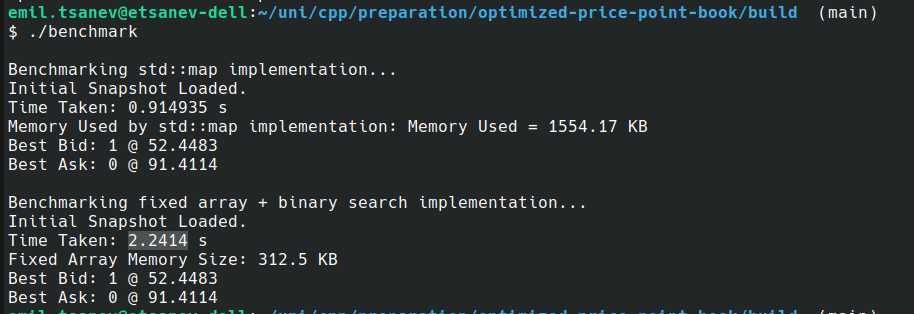

# **Optimized Price Point Book**


## **Task Overview**

The goal of this project is to efficiently maintain and benchmark an **order book** data structure. The order book holds buy (bids) and sell (asks) orders at various price levels. The challenge is to achieve **high performance** in terms of:
- Insertion, update and removal of orders.
- Fetching the best bid (highest buy price) and best ask (lowest sell price).

In order to be capable of handling events from the [Binance book dept stream](https://developers.binance.com/docs/binance-spot-api-docs/web-socket-streams#diff-depth-stream)

---

## **Implementations**

Two key implementations of the order book were developed:

1. **`std::map` Implementation**
   - Uses a **Red-Black Tree** (`std::map`) for maintaining sorted bids and asks.
   - Time Complexity:
     - **Insertion**: O(log N)
     - **Lookup for best bid/ask**: O(1)

2. **Fixed `std::array` + Binary Search Implementation**
   - Uses a **fixed-size array** for storage and **binary search** to maintain sorted order.
   - Time Complexity:
     - **Insertion**: average case O(log N); worst case - O(N)
     - **Lookup for best bid/ask**: O(1)


> [!NOTE]
> **Personal benchmark results:**<br>
> Even though I found an [*"article"*](https://quant.stackexchange.com/questions/63140/red-black-trees-for-limit-order-book) stating that the second implementation (fixed array) would be faster, during my testing and benchmarking the results were in favor of the balanced tree. (in terms of time) - for 1 million updates separated by 1000 updates every time.



### **Benchmarking**
The performance of both implementations is measured and compared based on:
- **Memory usage**.
- **Execution time** for order insertions and queries.

### **Unit Tests for correctness**
Unit tests are implemented to validate the order book functionality. These include tests for:
- Correct insertion and deletion of bids/asks.
- Correct retrieval of the best bid/ask price.
- Handling of edge cases.

### **Binance WebSocket Listener**

An **out-of-scope implementation** of a WebSocket listener was developed to fetch live order book updates from Binance. The implementation:
- Fetches the **initial snapshot** using Binance’s REST API.
- Connects to Binance’s WebSocket stream to process **depth updates** every 100ms.
- Updates the order book data structure in real time.

##### **Local Build Only**
The Binance WebSocket listener **works on the local build** but fails in the Docker container due to SSL certificate issues. This needs to be resolved for full Docker compatibility.


---

## **Local Build Instructions**

### **Prerequisites**
- `CMake` (version 3.14 or higher).
- `g++` compiler (C++20 support).
- Boost library (JSON, System, Thread components).
- `libssl-dev`.

### **Steps**
1. Clone the repository:

   ```bash
   git clone git@github.com:Emskiq/optimized-price-point-book.git
   cd optimized-price-point-book
   ```

2. Create a **build directory** and run CMake:

   ```bash
   mkdir build
   cd build
   cmake -DCMAKE_BUILD_TYPE=Release ..
   ```

3. Compile the project:

   ```bash
   make -j$(nproc)
   ```

4. Executables will be available in the `build` directory.

---

## **How to Run**

### **Benchmark**
I have separated the data generation and the actual benchmark in order to have 100% accurate results, since there was a lot of memory consumption in generating 1 million price updates.
<br>
To run the benchmark comparing the two implementations:

```bash
./build/generate_data   # Generates data files (e.g., snapshot and updates).
./build/benchmark       # Runs the benchmark tests.
```

### **Unit Tests**
To execute unit tests:

```bash
./build/tests
```

### **Binance Listener (Out of Scope)**
The Binance live listener is implemented but incomplete. For now, it can be compiled and executed as follows:

```bash
./build/binance_listener
```

---

## **Docker Build and Run**

### **Build Docker Image**
To build the Docker image locally:

```bash
docker build -t orderbook-app .
```

### **Run Benchmarks Inside Docker**

Run the data generation and benchmarks in a single command:

```bash
docker run --rm orderbook-app "./generate_data && ./benchmark"
```

### **Run Unit Tests**
Execute unit tests:

```bash
docker run --rm orderbook-app ./tests
```

---

## **TODOs and Limitations**

- Finalize the **Binance live connection** (`binance_listener`) for real-time order book updates.
- Add support for **multiple threads** to process different symbols concurrently.
- Implement double to integer conversion so the prices can be compared quickly
- **Binance WebSocket Listener**: Not functional under Docker due to SSL certificate verification failures. It works on the local build.
- Docker-based benchmarks may show buffered output due to I/O abstraction, but the program runs without issues.
- Mathc orders and actually do trades - be careful of the [rate limit of binance api points](https://dev.binance.vision/t/request-limit-on-the-api-endpoints/9275) though!
